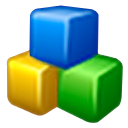

CPA - C++ Certified Associate Programmer
----------------------------------------

***

### 0. Installing and using your programming environment
#### 0.1.1 What is IDE?
This document is intended to show you how to install and use the programming environment allowing you to write, compile and run your own C/C++ language programs. We are going to guide you through the whole process step by step indicating the most important actions and issues.

You will need the access to the Internet connection as all of the installation files are downloaded from the product's sites. Sorry, there are no workarounds.

We also want to add that all the programs and examples may be successfully compiled and run without the use of any specialized environment but by merely using a standard text editor and command-line compiler tools. We don't recommend that. Using the programming environment (sometimes called `IDE - integrated development environment`) lets you be more productive and effective even when working with very simple or even trivial programs.

We've decided to use NetBeans although there are many other environments on the market, both free and non-free, which may be used interchangeably. We took on NetBeans because we had to make a choice but it doesn't mean that we are definitely convinced that NetBeans is the best of them all. We agree than other products may be more in line with your tastes and habits. There are no reasons for not following our path. Feel free to make your own decisions but we should warn you, that some of the  exercises we will offer may be preconfigured for NetBeans requirements and needs.

Other free IDEs worth mentioning are:

[Microsoft Visual Studio Express](http://www.microsoft.com/visualstudio/eng/products/visual-studio-express-products)

***

[Eclipse](http://www.eclipse.org)

***

[CodeLite](http://www.codelite.org)

***

[MonoDevelop](http://monodevelop.com)

***

The screen-shots we will show you here were taken in Windows 7 but all those actions may be performed in any other OS supported by NetBeans products. Some of the specific activities may look different there but we are sure that you will be able to deal with them. If you are a Linux user try to use your native system tools to download and install NetBeans. It will be easier and more effective than downloading it by yourself and spending some additional time on integrating the product with your system.

**Note**: the IDE itself is not a compiler! The C/C++ compiler must be installed separately before you start your work with the IDE.

If you are a Linux user, the C compiler (named `gcc`) and the C++ compiler (named `g++`) is (most likely) already installed. If you are Windows user, you have to install the compilers on you own.

#### 0.2.1 Installing compilers - step 1

We are going to install the MinGW/MSYS package which is a port of gcc/g++ compilers and tools for MS Windows systems.

Launch you favourite internet browser and go to:
<http://sourceforge.net/projects/mingw/files/Installer/mingw-get-inst/>

Look for the text ???Looking for the latest version??? and click the link located on the right. Of course, the name of the file may vary from the one presented on the screen-shot.

#### 0.2.2 Installing compilers - step 2

The download should start automatically. Expect that the browser will ask you what to do with the file being downloaded. Choose ???Save as??? and point any of you personal folders as a target location for the file. We've chosen ???Desktop??? to simplify the subsequent operations.

#### 0.2.3 Installing compilers - step 3

Wait until the download finishes. It may take some time depending on the speed of your Internet connection.

#### 0.2.4 Installing compilers - step 4

When the installer file is completely downloaded you may launch it. Do it now. Note: the operating system may ask for your permission to start the file. Answer ???Yes???. The welcome window appears on the screen. Click ???Next??? to start the installation.

#### 0.2.5 Installing compilers - step 5

If you start the installer with administrative rights, it will warn you that the compilers and tools will be installed system-wide (for all users). Accept this by clicking ???Next???.

#### 0.2.6 Installing compilers - step 6

The installer will ask you if you want to download and install the compilers from the pre-packaged repositories (stable) or from the last repositories. We suggest you accept the default answer.  Click ???Next???.

#### 0.2.7 Installing compilers - step 7

We suggest that you browse the licence agreement presented by the installer. Remember: do not sign anything without reading the contract.
Ready? Check the ???I accept the agreement.??? radio button and click ???Next???.

